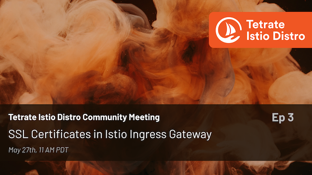

# SSL certificates in Istio ingress gateway 

- Hosted by [Orion Letizi](https://twitter.com/orionletizi)
- Presenters:
  - [Peter Jausovec](https://twitter.com/pjausovec)
- Recording date: May 26, 2021
- Video: https://www.youtube.com/watch?v=nYJJ57WCkxE&list=PLm51GPKRAmTnMzTf9N95w_yXo7izg80Jc

## Show notes

In episode 3, we will talk about how to set up SSL certificates in your Istio ingress gateway. We’ll show you how to use self-signed certificates (and why you should never do this) and how to automate certificate management.

Demo script for all scenarios is [here](demo.md).

## Links

- Community page: https://istio.tetratelabs.io/community
- Slack: https://slack.istio.io (search for the #GetIstio channel and join)
