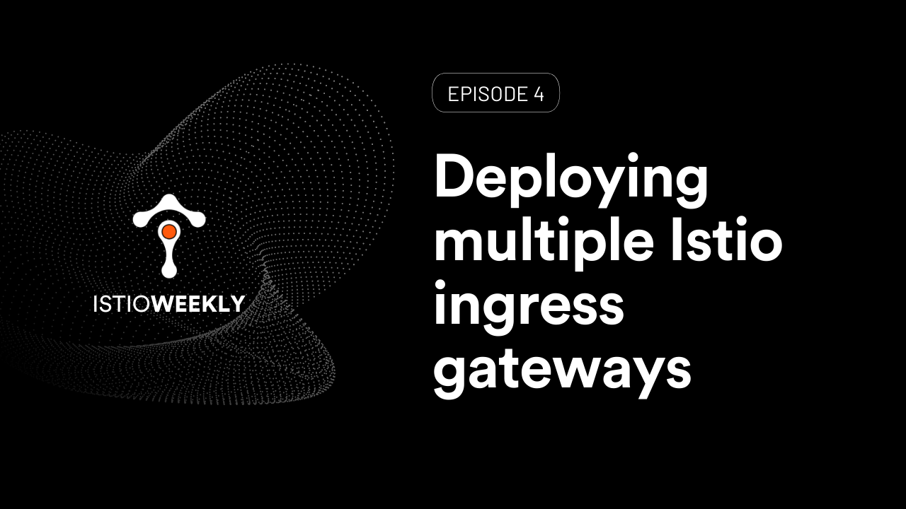

# Deploying multiple Istio ingress gateways 

- Hosted by [Orion Letizi](https://twitter.com/orionletizi)
- Presenters:
  - [Peter Jausovec](https://twitter.com/pjausovec)
- Streaming live: June 10th, 11 am PST, 2021
- Link: https://www.youtube.com/watch?v=QIkryA8HnQ0

## Show notes

How can you customize Istio installation? What is Istio operator and how can you configure it? Can I run multiple Istio ingress gateways? The answer is yes!  

Join us in this episode where introduce the Istio operator and talk about how to deploy multiple Istio ingress gateways. Running more than one Istio ingress gateway allows for more complex scenarios. For example, you can run a separate internal ingress gateway for internal traffic, a dedicated public gateway, or running any combination of internal and/or external ingress gateways.

[Demo script](demo.md)

## Episode notes

**News**

- Istio 1.10 Discovery selectors (article): https://www.tetrate.io/blog/discovery-selectors 
- Istio 1.10 Discovery selectors (video): https://www.youtube.com/watch?v=M3jK4s8MX7A
- Istio 1.10 Improves scalability and revision control (article): https://thenewstack.io/istio-1-10-improves-scalability-and-revision-control
- Intro to Tetrate Service Bridge (TSB): https://www.tetrate.io/blog/intro-to-tetrate-service-bridge
- Service mesh & the next generation of cloud networking with Varun Talwar (podcast): https://techblogwriter.co.uk/tetrate
- Istio Big Talk, the latest episode: https://www.bilibili.com/video/BV18o4y1y75e 

**Events**

- Jun 17, 10 a.m.: Zero-trust architecture for multi-cloud service mesh (Keyfacor + Tetrate Webinar): https://www.brighttalk.com/webcast/17778/491379

**Links**
- Istio operator: https://istio.io/latest/docs/setup/install/operator/
- Operator configuration: https://istio.io/latest/docs/reference/config/istio.operator.v1alpha1/
- Istio configuration profiles: https://istio.io/latest/docs/setup/additional-setup/config-profiles/

## Connect

- Follow us on [Twitter](https://twitter.com/tetrateio)
- Follow us on [LinkedIn](https://www.linkedin.com/company/tetrate)
- Past episodes: https://istioweekly.com

- Community page: https://istio.tetratelabs.io/community
- Slack: https://slack.istio.io (search for the #GetIstio channel and join)

## Participate

Suggest an episode: http://tetr8.io/istio-weekly-suggestions
