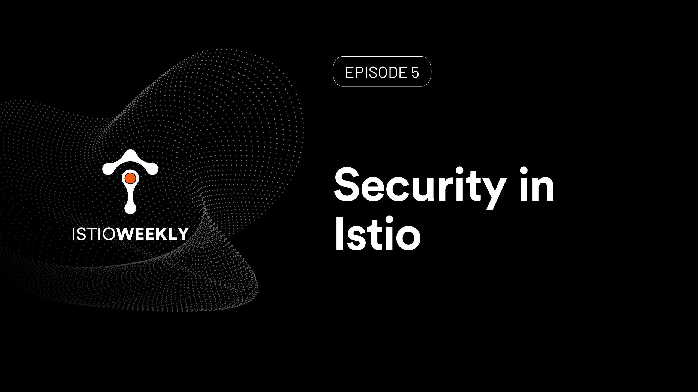

# Security in Istio 

- Hosted by [Orion Letizi](https://twitter.com/orionletizi)
- Presenters:
  - [Peter Jausovec](https://twitter.com/pjausovec)
- Streaming live: June 24th, 11 am PST, 2021
- Link: https://www.youtube.com/watch?v=_ExvSKOX_gY

## Show notes

In episode 5, we will talk about Security in Istio. You'll learn about the difference between authentication and authorization. We'll show you how to enable mutual TLS with peer authentication, use request authentication with Auth0, and how to control access to your workloads with the authorization policies.

[Demo script](demo.md)

## Episode notes

**News**

- Executive order mandates ZTA for federal agencies:
  - [Zero Trust Architecture (SP 800-207)](https://csrc.nist.gov/publications/detail/sp/800-207/final)
  - [Building Secure Microservices-based Applications Using Service-Mesh Architecture (SP 800-204A)](https://csrc.nist.gov/publications/detail/sp/800-204a/final)
  - [Attribute-based Access Control for Microservices-based Applications Using a Service Mesh (SP 800-204B)](https://csrc.nist.gov/news/2021/draft-sp-800-204b-abac-for-microservices-apps)
- Why you should choose NGAC as your access control model: tetr8.io/choose-ngac
- Offload authn/authz to the mesh: tetr8.io/service-mesh-auth
- Service mesh as security kernel: tetr8.io/mesh-security-kernel

**Events**

- July 6th - ZTA Webinar with USAF Chief Software Officer - [Register here](https://tetr8.io/zero-trust-webinar)
- Istio Weekly #6: Envoy fundamentals: https://www.youtube.com/watch?v=f0QEHEm9ERc

## Connect

- Follow us on [Twitter](https://twitter.com/tetrateio)
- Follow us on [LinkedIn](https://www.linkedin.com/company/tetrate)
- Past episodes: https://istioweekly.com

- Community page: https://istio.tetratelabs.io/community
- Slack: https://slack.istio.io (search for the #GetIstio channel and join)

## Participate

Suggest an episode: http://tetr8.io/istio-weekly-suggestions
