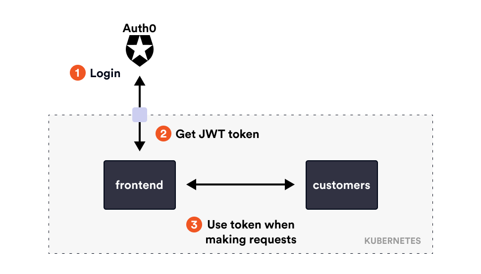

# Auth0 and Istio

In this demo we'll show how to use RequestAuthentication and AuthorizationPolicy resources together with Auth0 for authentication. Github repo with the web frontend app is [here](https://github.com/peterj/simple-login).



Set environment variables with the values from your Auth0 application/API:

```sh
export CLIENT_ID=[from Auth0 app]
export SECRET=[from auth0 app]
export ISSUER_BASE_URL=https://[YOUR_DOMAIN].us.auth0.com
export AUDIENCE=[identifier set in the Auth0 API]
export BASE_URL=[set to your ingress IP/domain name]
```

Next, create the secrets for the web-frontend workload:

```sh
kubectl create secret generic webfrontend-auth0 \
  --from-literal=CLIENT_ID=$CLIENT_ID \
  --from-literal=SECRET=$SECRET

kubectl create configmap webfrontend-auth0 \
    --from-literal=ISSUER_BASE_URL=$ISSUER_BASE_URL \
    --from-literal=AUDIENCE=$AUDIENCE \
    --from-literal=BASE_URL=$BASE_URL
```

Now we can create the deployment:

```sh
kubectl apply -f https://raw.githubusercontent.com/peterj/simple-login/main/k8s/deploy.yaml
```

And Gateway and the VirtualService:

```yaml
apiVersion: networking.istio.io/v1alpha3
kind: Gateway
metadata:
  name: gateway
spec:
  selector:
    istio: ingressgateway
  servers:
    - port:
        number: 80
        name: http
        protocol: HTTP
      hosts:
        - '*'
---
apiVersion: networking.istio.io/v1alpha3
kind: VirtualService
metadata:
  name: web-frontend
spec:
  hosts:
    - '*'
  gateways:
    - gateway
  http:
    - route:
        - destination:
            host: web-frontend.default.svc.cluster.local
            port:
              number: 80
```

If you go to the ingress IP, you'll notice that the website shows the data from the customers service. 

Let's set up the RequestAuthentication and resource and apply it to the customers workload. This resource will check that anything calling the customers service has a valid JWT token set:

```yaml
apiVersion: security.istio.io/v1beta1
kind: RequestAuthentication
metadata:
 name: customers
spec:
  selector:
    matchLabels:
      app: customers
  jwtRules:
    # Note: Replace with your own issuer/jwksUri
  - issuer: "https://istioweekly.us.auth0.com/"
    jwksUri: "https://istioweekly.us.auth0.com/.well-known/jwks.json"
```

If we refresh the page again, everything will still work. Remember that authentication without authorization is not really helpful.

Let's create the AuthorizationPolicy that will require all callers to the customer service to have a request principal set (note that we aren't checking for any specific request principal, we just want to have *a* request principal set):

```yaml
apiVersion: security.istio.io/v1beta1
kind: AuthorizationPolicy
metadata:
  name: require-jwt
spec:
  selector:
    matchLabels:
      app: customers
  action: ALLOW
  rules:
  - from:
    - source:
       requestPrincipals: ["*"]
```

Finally, if we refresh the page again, we'll  get back the HTTP 403 response. This means that we aren't authorized to call the customers service. If we click the login link and register, then we'll be able to access the service, because the request will have a valid JWT token attached to the request..

## Cleanup 

```sh
kubectl delete secret webfrontend-auth0
kubectl delete configmap webfrontend-auth0
kubectl delete -f https://raw.githubusercontent.com/peterj/simple-login/main/k8s/deploy.yaml
kubectl delete gateway gateway
kubectl delete virtualservice web-frontend
kubectl delete authorizationpolicy require-jwt
kubectl delete RequestAuthentication customers
```