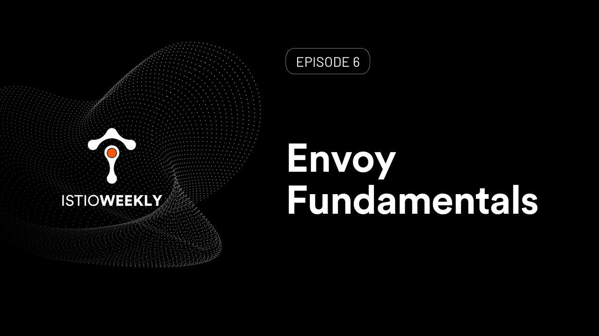

# Envoy Fundamentals 

- Hosted by [Orion Letizi](https://twitter.com/orionletizi)
- Presenters:
  - [Peter Jausovec](https://twitter.com/pjausovec)
- Streaming live: July 8th, 11 am PST, 2021
- Link: https://www.youtube.com/watch?v=f0QEHEm9ERc

## Show notes

Envoy is one part of the engine that keeps Istio running. How does Envoy work? What are listeners, clusters, and endpoints?

Join us on July 8th for another Istio weekly episode where we'll introduce the fundamentals of Envoy proxy.

Check out the [demo here](demo.md).

## Episode notes

[Envoy Deep Dive (by Lizan Zhou)](https://www.youtube.com/watch?v=spzfupads2o)

[Lyft's Envoy: Embracing a service mesh (by Matt Klein)](https://www.youtube.com/watch?v=55yi4MMVBi4)

[Making Envoy Contributions Feasible for Everyone (by Yaroslav Skopets)](https://www.youtube.com/watch?v=mJAYHHKmLhU)

[Envoy & Service Mesh for Databases: what the Future Holds (by Christoph Pakulski and Prasad Radhakrishnan)](https://www.youtube.com/watch?v=muyVO6C3em8)

## Connect

- Follow us on [Twitter](https://twitter.com/tetrateio)
- Follow us on [LinkedIn](https://www.linkedin.com/company/tetrate)
- Past episodes: https://istioweekly.com

- Community page: https://istio.tetratelabs.io/community
- Slack: https://slack.istio.io (search for the #GetIstio channel and join)

## Participate

Suggest an episode: http://tetr8.io/istio-weekly-suggestions
