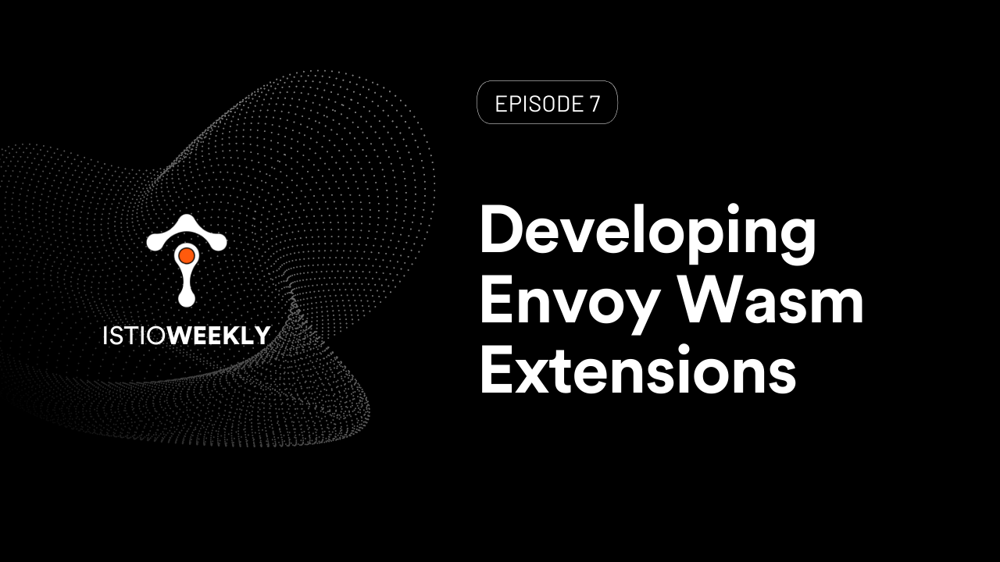

# Developing Envoy Wasm Extensions 

- Hosted by [Orion Letizi](https://twitter.com/orionletizi)
- Presenters:
  - [Peter Jausovec](https://twitter.com/pjausovec)
- Streaming live: July 22nd, 11 am PST, 2021
- Link: https://www.youtube.com/watch?v=JIq8wujlG9s

## Show notes

WebAssembly (Wasm) and the Envoy Proxy Wasm SDK are a way to extend the Envoy proxy functionality. We'll show you how to use the Proxy Wasm Go SDK and func-e CLI (https://func-e.io) to develop and test your Wasm extensions.

[DEMO](demo.md)

## Episode notes

**Resources**
- [func-e CLI](https://func-e.io)
- [Wasm modules and Envoy extensibility explained](https://tetr8.io/wasm-modules-and-envoy-extensibility)
- [WebAssembly for app security and extensibility](https://tetr8.io/webassembly-security-and-extensibility)
- [Istio security assessment](https://tetr8.io/istio-security-assessment)
- [Free Istio labs](https://tetr8.io/istio-fundamentals)

**Events**

- August 4th, 2021: [Tetrate & Mirantis joint webinar: Istio in the enterprise](https://tetr8.io/istio-in-the-enterprise-webinar)
- On demand: [ZTA webinar with USAF chief software officer](https://tetr8.io/zero-trust-at-DoD)

## Connect

- Follow us on [Twitter](https://twitter.com/tetrateio)
- Follow us on [LinkedIn](https://www.linkedin.com/company/tetrate)
- Past episodes: https://istioweekly.com

- Community page: https://istio.tetratelabs.io/community
- Slack: https://slack.istio.io (search for the #GetIstio channel and join)

## Participate

Suggest an episode: http://tetr8.io/istio-weekly-suggestions