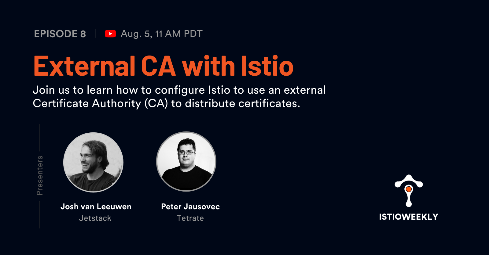

# External CA with Istio

- Hosted by [Orion Letizi](https://twitter.com/orionletizi), [Peter Jausovec](https://twitter.com/pjausovec)
- Guests:
  - [Josh van Leeuwen](https://twitter.com/joshvanl)
- Streamed live on August 5th, 11 am PST, 2021
- Link: https://www.youtube.com/watch?v=4b3H7isIAnQ

## Show notes

Istio CA generates a self-signed root certificate and key and uses them to sign all workload certificates. In this episode,  [Josh van Leeuwen](https://twitter.com/joshvanl) from [Jetstack](https://jetstack.io) will show us how to configure Istio and use [istio-csr](https://github.com/cert-manager/istio-csr)/[cert-manager](https://cert-manager.io/) to configure external CA for Istio to use.

[DEMO](https://github.com/JoshVanL/tetrate-istio-weekly-2021-08-05)
[Slides (PDF)](https://github.com/JoshVanL/tetrate-istio-weekly-2021-08-05/blob/main/assets/istio_External_CA.pdf)

## Episode notes

**Weekly highlights**
[Istio as an API Gateway](https://tetr8.io/istio-api-gateway)
[Get started with Envoy in 5 min](https://tetr8.io/5-minute-envoy)
[How to debug microservices in Kubernetes](https://tetr8.io/debug-microservices)
[Tetrate Certified Istio Administrator](https://tetr8.io/istio-administrator)

**Resources**
- [Jetstack](https://www.jetstack.io/)
- [Use Istio service mesh and deploy mTLS everywhere (Ebook)](https://campaigns.jetstack.io/istio_service_mesh/)
- [Secure production identity framework for everyone (SPIFFE)](https://spiffe.io)
- [cert-manager](https://github.com/jetstack/cert-manager)
- [istio-csr](https://github.com/jetstack/istio-csr)
- [Istio Workload Certificate API](https://docs.google.com/document/d/1QACaJW8LpQMvdbPd-EoVtYNcNprTb6vScj72k-qHyT4/edit#heading=h.as1yzu52kj40)

## Connect

- Follow us on [Twitter](https://twitter.com/tetrateio)
- Follow us on [LinkedIn](https://www.linkedin.com/company/tetrate)
- Past episodes: https://istioweekly.com

- Community page: https://istio.tetratelabs.io/community
- Slack: https://slack.istio.io (search for the #GetIstio channel and join)

## Participate

Suggest an episode: http://tetr8.io/istio-weekly-suggestions