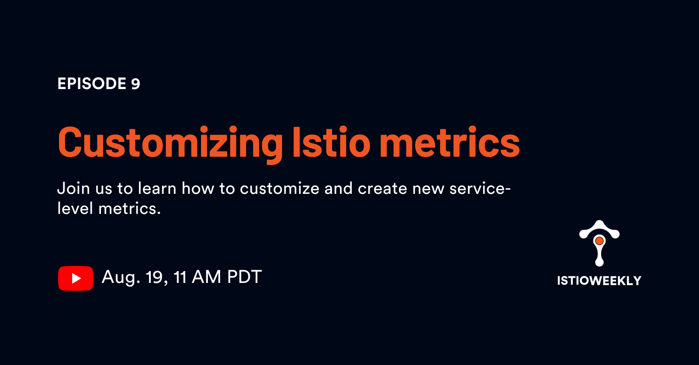

# Customizing Istio metrics

- Hosted by [Orion Letizi](https://twitter.com/orionletizi)
- Presenters:
  - [Peter Jausovec](https://twitter.com/pjausovec)
- Streamed live on August 19th, 11 am PST, 2021
- Link: https://www.youtube.com/watch?v=hhoKWEBGM_c

## Show notes

In this episode we talked about customizing and creating new Istio service-level metrics.

[DEMO](demo.md)

## Episode notes

- [Istio 1.11 release](https://tetr8.io/istio-1-11)

**Resources**

- [Envoy attributes](https://www.envoyproxy.io/docs/envoy/latest/intro/arch_overview/advanced/attributes)
- [Attributes in Istio source](https://github.com/istio/proxy/blob/master/src/istio/utils/attribute_names.cc)
- [Standard Istio metrics](https://istio.io/latest/docs/reference/config/metrics/)
- [Stats Wasm extension](https://github.com/istio/proxy/tree/master/extensions/stats)
- [Stats configuration](https://istio.io/latest/docs/reference/config/proxy_extensions/stats/)
- [Attribute gen configuration](https://istio.io/latest/docs/reference/config/proxy_extensions/attributegen/)

**Events**

- August 25th, 11am: [Zero Trust with a Service Mesh](https://www.tetrate.io/event/zero-trust-with-a-service-mesh/)
- August 31st, 11am: [Application Security in a Contactless World: A fintech roundtable](https://www.tetrate.io/event/application-security-in-a-contactless-world-a-fintech-roundtable/)

## Connect

- Follow us on [Twitter](https://twitter.com/tetrateio)
- Follow us on [LinkedIn](https://www.linkedin.com/company/tetrate)
- Past episodes: https://istioweekly.com

- Community page: https://istio.tetratelabs.io/community
- Slack: https://slack.istio.io (search for the #GetIstio channel and join)

## Participate

Suggest an episode: http://tetr8.io/istio-weekly-suggestions
