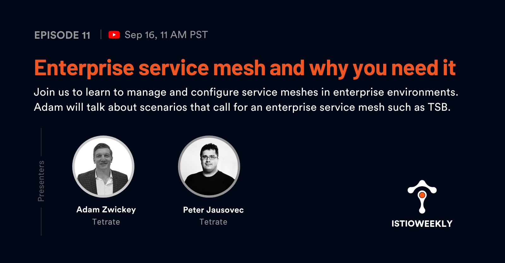

# Enterprise service mesh and why you need it

- Hosted by [Orion Letizi](https://twitter.com/orionletizi), [Peter Jausovec](https://twitter.com/pjausovec)
- Guests:
  - [Adam Zwickey](https://twitter.com/zwickey)
- Streamed live on September 16th, 11 am PST, 2021
- Link: https://www.youtube.com/watch?v=HQ3BBsJDeXU

## Show notes

Join us on September 16th for another Istio weekly episode where we'll talk to Adam Zwickey, director of global solutions engineering at Tetrate. Adam will talk about scenarios that call for an enterprise service mesh, such as TSB. He’ll show us how TSB can help us manage and configure service meshes in enterprise environments. 

## Episode notes

- [Tetrate Service Bridge (TSB)](https://www.tetrate.io/tetrate-service-bridge/)
- [Local-aware routing demo](https://www.youtube.com/watch?v=v_PVxsYiZts&t=0s)

## Connect

- Follow us on [Twitter](https://twitter.com/tetrateio)
- Follow us on [LinkedIn](https://www.linkedin.com/company/tetrate)
- Past episodes: https://istioweekly.com

- Community page: https://istio.tetratelabs.io/community
- Slack: https://slack.istio.io (search for the #GetIstio channel and join)

## Participate

Suggest an episode: http://tetr8.io/istio-weekly-suggestions
