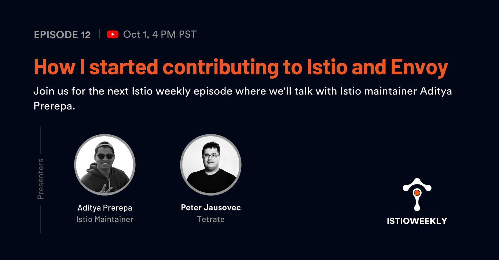

# How I started contributing to Istio and Envoy

- Hosted by [Orion Letizi](https://twitter.com/orionletizi), [Peter Jausovec](https://twitter.com/pjausovec)
- Guests:
  - [Aditya Prerepa](https://twitter.com/aprerepa)
- Streamed live on Octover 1st, 4 pm PST, 2021
- Link: https://youtu.be/o3Fi6nwuuiI

## Show notes

Join us on October 1st for the next Istio weekly episode where we'll talk with Istio maintainer Aditya Prerepa.

In addition to being a member of the Istio networking working group, Aditya is also finishing high school this year. He’s worked on Istio for more than a year with a focus on Pilot and xDS as well as VM health checking, auto registration, and multitenancy.

With Hacktoberfest coming up, we’ll discuss what Aditya is currently working on, how he started contributing to Istio and Envoy, his upcoming EnvoyCon talk, and any tips he has for anyone trying to start contributing to Istio/Envoy and other open-source projects. 

## Episode notes

- [EKS is Anywhere and so is Tetrate](https://www.tetrate.io/blog/tetrate-eks-anywhere/)
- [Tetrate Academy (Istio fundamentals course)](https://academy.tetrate.io/collections)
- [Envoycon 2021](https://events.linuxfoundation.org/envoycon-north-america/)

- [Aditya's Twitter](https://twitter.com/APrerepa)
- [Aditya's Github](https://github.com/adiprerepa)

- [Istio Github](https://github.com/istio)
- [Hacktoberfest](https://hacktoberfest.digitalocean.com/)
- [func-e hacktoberfest issues](https://github.com/tetratelabs/func-e)

## Connect

- Follow us on [Twitter](https://twitter.com/tetrateio)
- Follow us on [LinkedIn](https://www.linkedin.com/company/tetrate)
- Past episodes: https://istioweekly.com

- Community page: https://istio.tetratelabs.io/community
- Slack: https://slack.istio.io (search for the #GetIstio channel and join)

## Participate

Suggest an episode: http://tetr8.io/istio-weekly-suggestions
