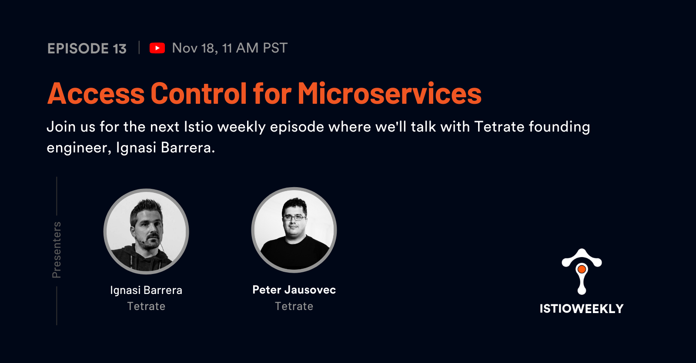

# Access Control for Microservices

- Hosted by [Orion Letizi](https://twitter.com/orionletizi), [Peter Jausovec](https://twitter.com/pjausovec)
- Guests:
  - [Ignasi Barrera](https://twitter.com/ignasibarrera)
- Streamed live on November 18th, 11 am PST, 2021
- Link: https://youtu.be/ItpCGpYupQQ

## Show notes

Join us on November 18th for the next Istio weekly episode where we'll talk with Tetrate founding engineer, Ignasi Barrera.

Ignasi leads the development of a modern security solution for the hybrid and multi-cloud worlds, based on NGAC - Next Generation Access Control. In this episode, we’ll talk about access control for microservices and we’ll explain what NGAC is and why it matters to you.

## Episode notes

- [Building Secure Microservices-based Applications Using Service-Mesh Architecture (SP800-204A)](https://csrc.nist.gov/publications/detail/sp/800-204a/final)
- [Attribute-based Access Control for Microservices-based Applications using a Service Mesh (SP800-204B - public draft)](https://csrc.nist.gov/publications/detail/sp/800-204b/draft)
- Application of DevSecOps using a Service Mesh in Microservices-based Infrastructure(SP800-204C UPCOMING)
- [Identity Management & Access Control in Multiclouds (Workshop and Conference)](https://www.nist.gov/news-events/events/2020/01/identity-management-access-control-multiclouds-workshop-and-conference)
- [DevSecOps and Zero Trust Architecture (ZTA) for Multi-Cloud Environments](https://www.nist.gov/news-events/events/2021/01/devsecops-and-zero-trust-architecture-zta-multi-cloud-environments)

- [Tetrate Academy (Envoy fundamentals course)](https://academy.tetrate.io/courses/envoy-fundamentals)

## Connect

- Follow us on [Twitter](https://twitter.com/tetrateio)
- Follow us on [LinkedIn](https://www.linkedin.com/company/tetrate)
- Past episodes: https://istioweekly.com

- Community page: https://istio.tetratelabs.io/community
- Slack: https://slack.istio.io (search for the #GetIstio channel and join)

## Participate

Suggest an episode: http://tetr8.io/istio-weekly-suggestions
