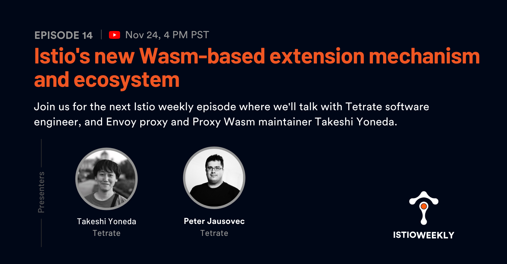

# Istio's new Wasm-based extension mechanism and ecosystem

- Hosted by [Orion Letizi](https://twitter.com/orionletizi), [Peter Jausovec](https://twitter.com/pjausovec)
- Guests:
  - [Takeshi Yoneda](https://twitter.com/mathetake)
- Streamed live on November 24th, 4 pm PST, 2021
- Link: https://www.youtube.com/watch?v=hkREEicBgDc

## Show notes

Join us on November 24th for the next Istio weekly episode where we'll talk with Tetrate software engineer and Envoy proxy and Proxy Wasm maintainer Takeshi Yoneda.

In this episode, Takeshi will give us an overview of WebAssembly (Wasm) in Istio and talk about exciting new Wasm-related features he worked on for the Istio 1.12 release.

## Episode notes

- [New in Istio 1.12: Wasm-based extensions and ecosystem (tutorial + DEMO)](https://www.tetrate.io/blog/istio-wasm-extensions-and-ecosystem/)
- [Istio Weekly EP07 - Developing Envoy Wasm Extensions](https://www.youtube.com/watch?v=JIq8wujlG9s&t=2s)
- [Proxy-Wasm Go SDK examples](https://github.com/tetratelabs/proxy-wasm-go-sdk/tree/main/examples)
- [Proxy-Wasm spec](https://github.com/proxy-wasm/spec)
- [Istio Wasm Extensions Workshop](https://www.tetrate.io/istio-wasm-workshop/)

## Connect

- Follow us on [Twitter](https://twitter.com/tetrateio)
- Follow us on [LinkedIn](https://www.linkedin.com/company/tetrate)
- Past episodes: https://istioweekly.com

- Community page: https://istio.tetratelabs.io/community
- Slack: https://slack.istio.io (search for the #GetIstio channel and join)

## Participate

Suggest an episode: http://tetr8.io/istio-weekly-suggestions
