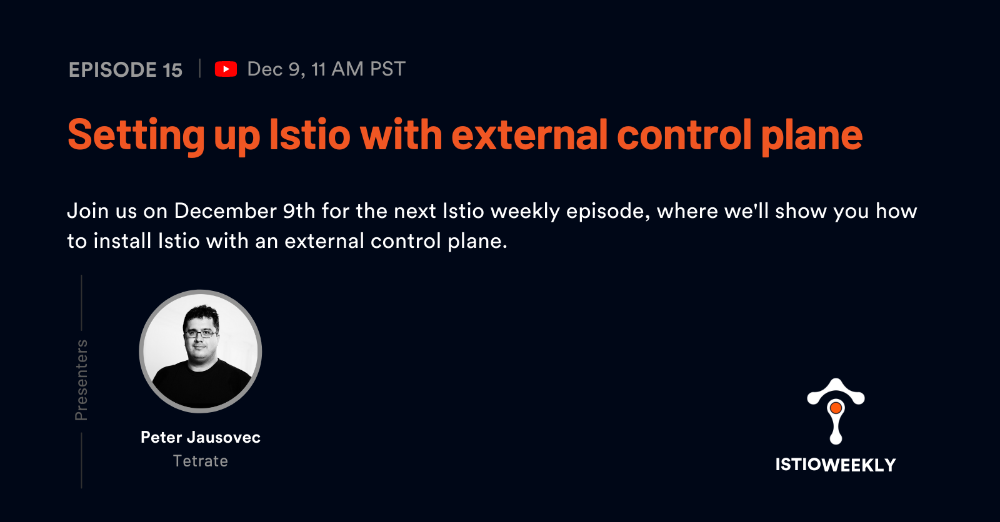

# Setting up Istio with external control plane

- Hosted by [Peter Jausovec](https://twitter.com/pjausovec)
- Streamed live on December 9th, 11 am PST, 2021
- Link: https://www.youtube.com/watch?v=MaQ3PvXcT9c

## Show notes

Join us on December 9th for the next Istio weekly episode, where we'll show you how to install Istio with an external control plane.

The external control plane deployment model offers a clean separation between mesh operators and mesh administrators.  Mesh operators install and manage Istio’s control plane on one cluster and then connect one or more remote clusters (data planes) to form a mesh. Mesh administrators can then configure the mesh as needed.

## Episode notes

- [Setting up external control plane tutorial](https://istio.io/latest/docs/setup/install/external-controlplane/)

- [Securing the ingress gateway](https://istio.io/latest/docs/tasks/traffic-management/ingress/secure-ingress/)

At [23:22](https://youtu.be/MaQ3PvXcT9c?t=1401) when creating the TLS secret. The .zip from SSLForFree contains 3 files:

1. ca_bundle.crt
2. certificate.crt
3. private.key

Instead of creating a secret and passing in certificate.crt for the --cert argument, you need to merge the ca_bundle with the certificate. So, create a new file called `combined.crt` paste in the contents of the `certificate.crt` file and then below that paste the contents of the `ca_bundle.crt` file. 

Then you can create the TLS secret and reference the `combined.crt` file instead: "kubectl create secret tls cp-istioweekly --key=private.key --cert=combined.crt".

## Connect

- Follow us on [Twitter](https://twitter.com/tetrateio)
- Follow us on [LinkedIn](https://www.linkedin.com/company/tetrate)
- Past episodes: https://istioweekly.com

- Community page: https://istio.tetratelabs.io/community
- Slack: https://slack.istio.io (search for the #GetIstio channel and join)

## Participate

Suggest an episode: http://tetr8.io/istio-weekly-suggestions