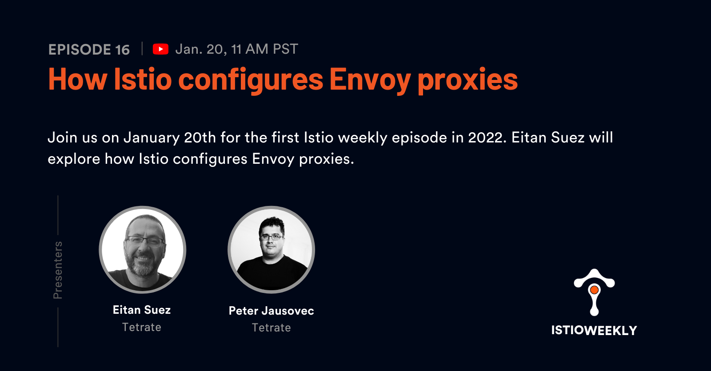

# How Istio configures Envoy proxies

- Hosted by [Peter Jausovec](https://twitter.com/pjausovec) and Eitan Suez
- Streamed live on January 20th, 11 am PST, 2021
- Link: https://www.youtube.com/watch?v=8X_pSA5eRTY

## Show notes

Join us on January 20th for the first Istio weekly episode in 2022. Eitan Suez will explore how Istio configures Envoy proxies.

Have you ever wondered what happens when you deploy a VirtualService or a DestinationRule? We know Istio translates the high-level configuration to the low-level Envoy configuration, but do we really understand how the different concepts map to each other? Eitan will show us how to use Istio CLI, proxy-status, and proxy-config commands to inspect the parts of Envoy configuration. Join us!

## Upcoming events

[January 26-27, 2022: ZTA and DevSecOps for Cloud-Native Applications]https://tetr8.io/nist-2022]
[February 3, 2022: Istio Wasm Extensions Workshop](https://tetr8.io/wasm-workshop)
[Febuary 17th, 2022: Istio 0 to 60 workshop (PST)](https://tetr8.io/istio-0-60-pst)
[Febuary 17th, 2022: Istio 0 to 60 workshop (IST)](https://tetr8.io/istio-0-60-ist)

## Connect

- Follow us on [Twitter](https://twitter.com/tetrateio)
- Follow us on [LinkedIn](https://www.linkedin.com/company/tetrate)
- Past episodes: https://istioweekly.com

- Community page: https://istio.tetratelabs.io/community
- Slack: https://slack.istio.io (search for the #GetIstio channel and join)

## Participate

Suggest an episode: http://tetr8.io/istio-weekly-suggestions